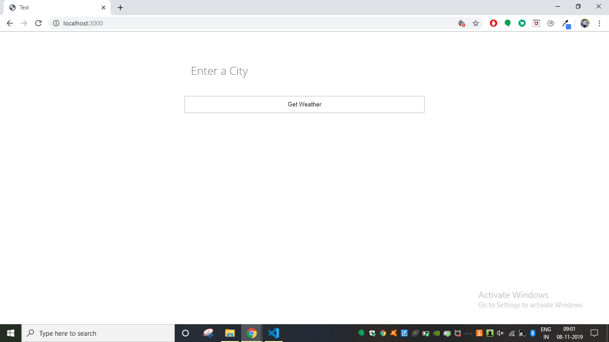
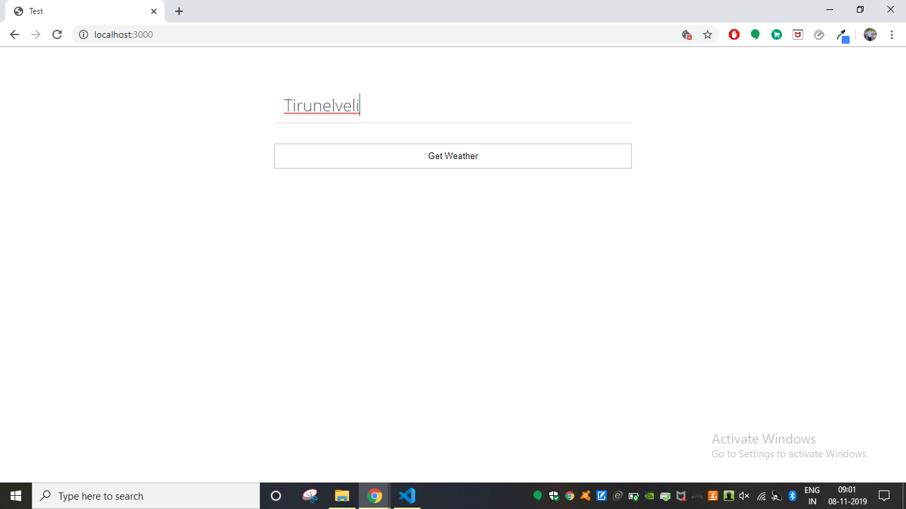
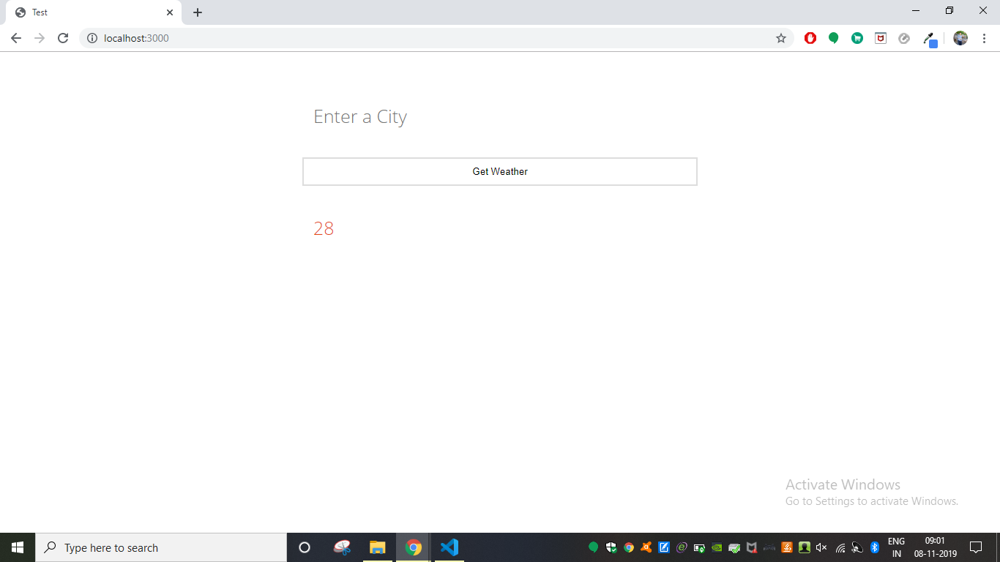

# Weather App V 2.0
Weather is one of the major factors that affects our day-to-day routine. Starting from a good morning till a lovely night, weather plays an important role. There are tonnes of methods to forecast this weather but only a few brings the result whenever and wherever we want. This project is an advanced version such a web application(Weather App V 1.0), designed to give the forecasted weather result to the end user. (This app is under fine tuning)

## Getting Started

Follow steps below to download and run this project in local machine
1. Click on 'Clone or download'
2. CLick 'Download ZIP'
3. Extract the .zip file to the preferred location.

### Prerequisites

* html
* css
* javascript
* nodejs

## Working

1. Open the index.html to start the application

2. Type input in the input box given

3. Result will be displayed.

## Author

[**Ajith C Ravi**](https://github.com/ajithcravi)
